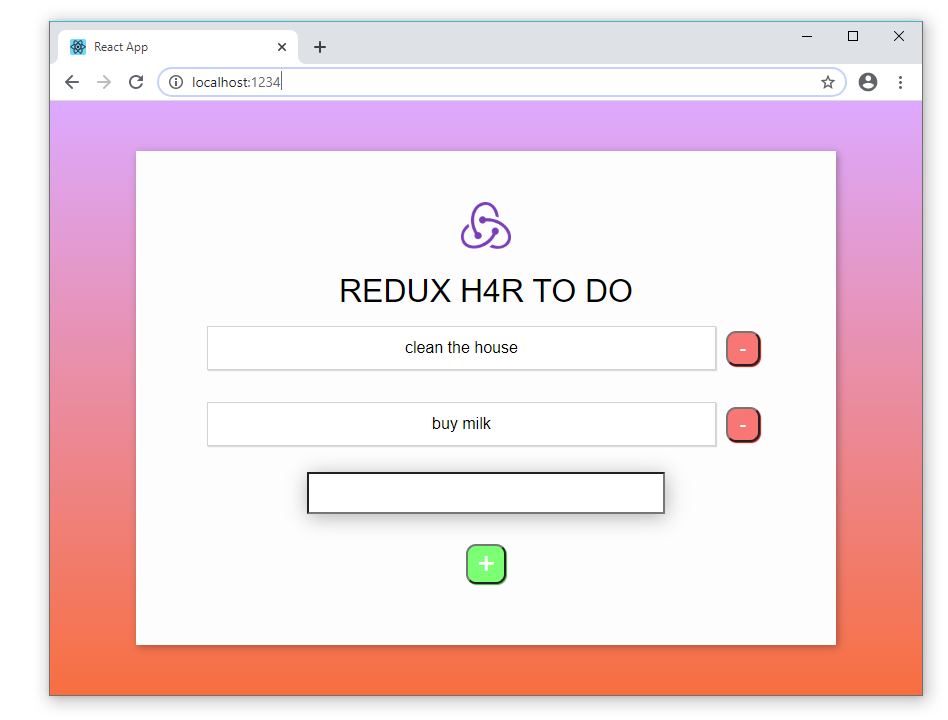

## modular-redux-todo

A Typescript implementation of the [modular-redux-todo-2020] example using [hooks-for-redux] (H4R). This
simple todo list example can be used as a stepping stone before using H4R in
something more complex (see the [rtk-github-issues-example-h4r-conversion]).

**[Modular Redux — a Design Pattern for Mastering Scalable, Shared State in React]** explains the thinking
behind H4R. It's great enhancement to the basic Redux which I've always disliked, for
the exact same reasons given in the article. If you find implementing Redux messy and painful 
then [hooks-for-redux] is for you.

[hooks-for-redux]: https://github.com/generalui/hooks-for-redux
[modular-redux-todo-2020]: https://github.com/shanebdavis/modular-redux-todo-2020
[rtk-github-issues-example-h4r-conversion]: https://github.com/shanebdavis/rtk-github-issues-example-h4r-conversion
[Modular Redux — a Design Pattern for Mastering Scalable, Shared State in React]: https://medium.com/@shanebdavis/modular-redux-a-design-pattern-for-mastering-scalable-shared-state-82d4abc0d7b3
